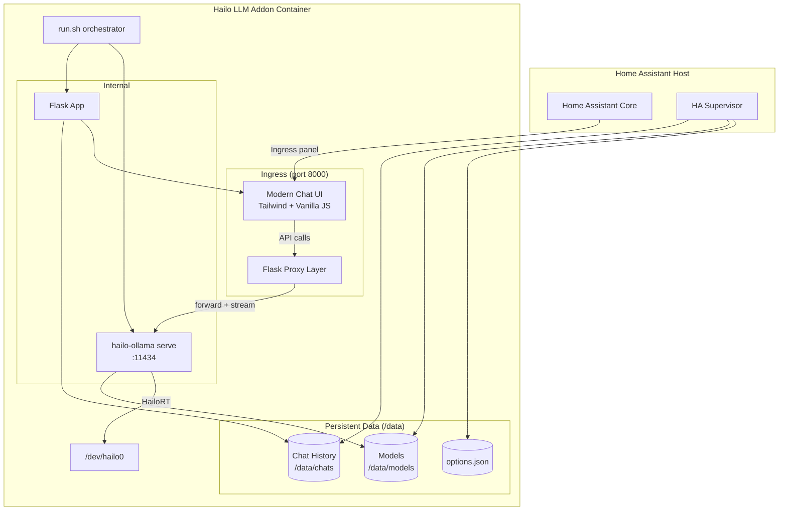
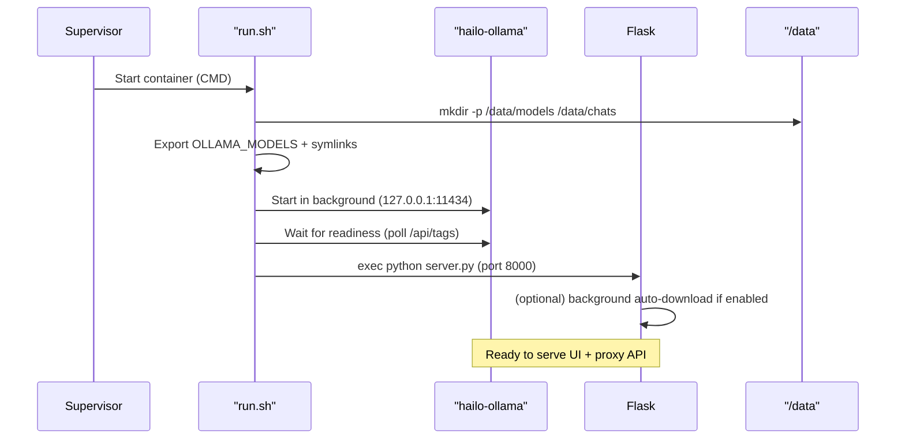
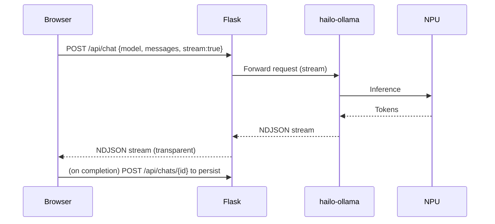
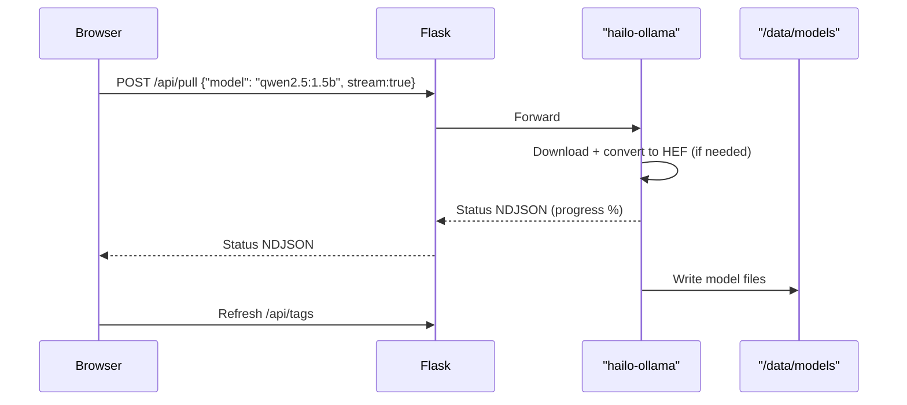

# Architecture Overview

This document describes the internal architecture of the Hailo LLM Home Assistant addon (v2.0+).

## High-Level Goals

- Provide a **self-contained** LLM experience for HAOS users with Hailo AI HAT+ 2 hardware.
- Deliver a **modern interactive chat UI** directly in the addon (no extra containers).
- Remain **fully compatible** as an Ollama-like backend so existing HA conversation integrations and tools continue to work.
- Guarantee **persistence** of models and chat history across reboots using only HAOS-standard `/data` storage.

## Core Components

| Component              | Type          | Location in Container          | Responsibility |
|------------------------|---------------|--------------------------------|----------------|
| `hailo-ollama`         | Binary (C++)  | Installed by `.deb` (`/usr/bin`) | Inference engine. Exposes Ollama-compatible REST API on top of HailoRT. Uses HEF models from the GenAI Model Zoo. |
| Flask Application      | Python (WSGI) | `/opt/hailo_llm/server.py`     | Serves the rich single-page chat UI + acts as a transparent proxy for API compatibility. |
| `run.sh`               | Shell script  | `/opt/hailo_llm/run.sh`        | Entry point. Sets up persistent storage, launches the binary in the background on an internal port, then starts the Python server on the ingress port. |
| Docker Image           | Container     | Built from `Dockerfile`        | aarch64-debian base + Hailo runtime + Python deps + rootfs. |
| Persistent Storage     | Host volume   | `/data` (mapped by HA supervisor) | Models (`/data/models`), chat history (`/data/chats`), addon options. |

## System Diagram (Mermaid)



## Startup Sequence



## Request Flows

### Chat (Streaming)



### Model Download (with Progress)



## Persistence Layout

```
/data/                     # Persistent volume provided by HA supervisor
├── models/                # OLLAMA_MODELS target. Contains HEF + manifest files
│   └── ...
├── chats/                 # Server-side conversation storage
│   ├── <uuid>.json
│   └── ...
└── options.json           # Addon configuration (read by run.sh + Flask)
```

Chat files are simple JSON:

```json
{
  "id": "...",
  "title": "Conversation about lights",
  "model": "qwen2.5:1.5b",
  "messages": [
    {"role": "user", "content": "...", "ts": 1720000000},
    {"role": "assistant", "content": "...", "ts": 1720000001}
  ],
  "created": 1720000000,
  "updated": 1720000100
}
```

## Key Architectural Decisions

1. **Internal port for the binary + proxy on ingress port**
   - The `hailo-ollama` binary wants to own a port.
   - We need to serve HTML/JS for the UI at the same ingress URL.
   - Solution: binary on `127.0.0.1:11434`, Flask listens on `0.0.0.0:8000` and proxies `/api/*` + `/hailo/*` while serving the UI at `/`.
   - Benefit: users get both a great UI and unchanged API surface.

2. **Server-side chat persistence (instead of only localStorage)**
   - Matches the "models must survive reboot" requirement.
   - Conversations remain available across browsers/devices that can reach the ingress.
   - Simple file-based JSON storage (no extra database dependency).

3. **Self-contained UI**
   - The entire chat interface is a single large HTML string (with Tailwind via CDN + vanilla JS) embedded in `server.py`.
   - No Node build step, no additional static assets to manage in the image.
   - Easy to iterate while keeping the addon image small.

4. **Defensive symlinks for model location**
   - The binary has historically looked in several places (`~/.ollama`, `/usr/share/hailo-ollama`, etc.).
   - We set `OLLAMA_MODELS=/data/models` and create symlinks so future updates to the binary are less likely to break persistence.

5. **Thin proxy instead of re-implementing the server**
   - We rely on the official `hailo-ollama` binary (best performance and model support).
   - The Python layer only adds what is necessary (UI + persistence + auto-download hook).

## Technology Stack Summary

- **Base image**: Home Assistant official aarch64 Debian bookworm
- **Inference**: `hailo-ollama` (C++ / HailoRT 5.3)
- **Web layer**: Flask + requests (proxy + minimal API)
- **Frontend**: Tailwind (CDN) + vanilla JavaScript + Font Awesome (CDN)
- **Process supervisor**: tini (already in base image)
- **Persistence**: Plain files under `/data` (guaranteed by HA supervisor)

## Future Evolution Notes

- The current proxy is intentionally minimal. If the binary's API fidelity improves or more OpenAI-compatible endpoints are needed, the proxy layer can be extended.
- Vision / multimodal support can be added when the Hailo GenAI Zoo ships suitable models and the binary surfaces image inputs.
- A production WSGI server (e.g. gunicorn or waitress) can replace the Flask dev server if load increases.

See [dependencies.md](dependencies.md) for a detailed breakdown of every package and why it exists.
