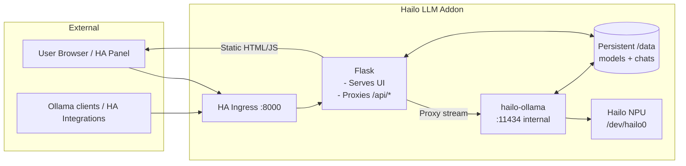

# Component Diagram (Mermaid)

```mermaid
graph LR
    subgraph External
        User[User Browser / HA Panel]
        Clients[Ollama clients / HA Integrations]
    end

    subgraph "Hailo LLM Addon"
        Ingress[HA Ingress :8000]
        Flask[Flask<br/>- Serves UI<br/>- Proxies /api/*]
        Binary[hailo-ollama<br/>:11434 internal]
        NPU[Hailo NPU<br/>/dev/hailo0]
        Storage[(Persistent /data<br/>models + chats)]
    end

    User --> Ingress
    Clients --> Ingress
    Ingress --> Flask
    Flask -->|Static HTML/JS| User
    Flask -->|Proxy stream| Binary
    Binary --> NPU
    Binary <--> Storage
    Flask <--> Storage
```

**Notes**
- The ingress port is the single external entry point.
- All inference goes through the official binary.
- Storage is the only durable state.
